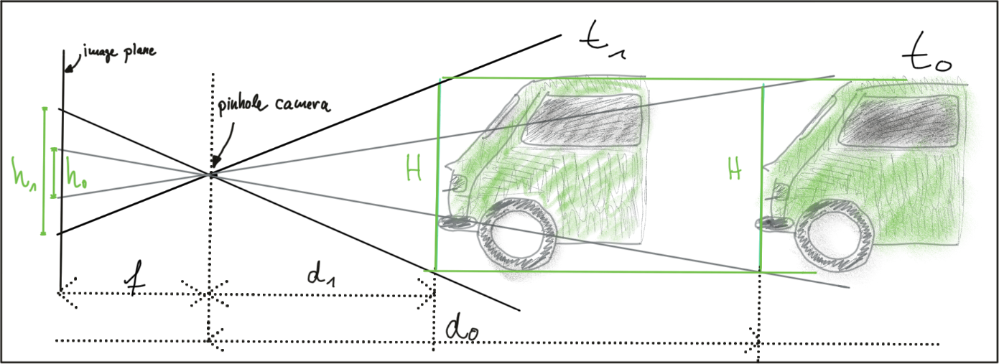
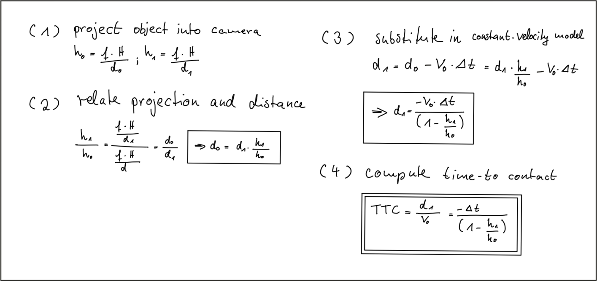
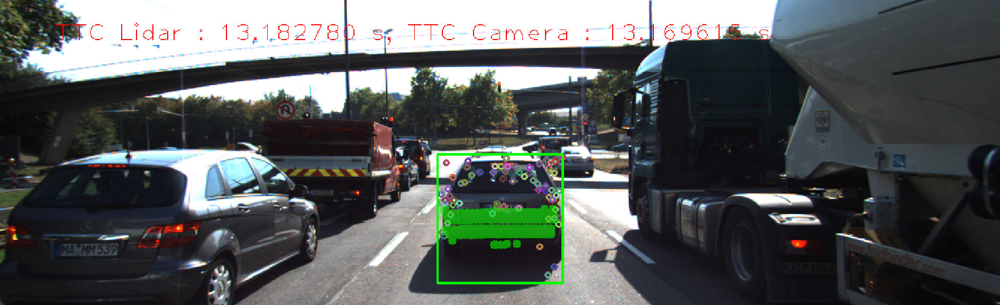
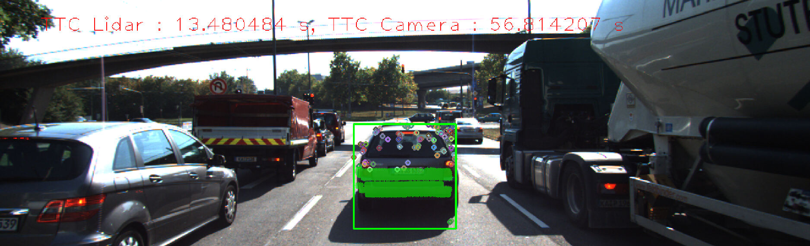

# SFND 3D Object Tracking

Welcome to the final project of the camera course. By completing all the lessons, you now have a solid understanding of keypoint detectors, descriptors, and methods to match them between successive images. Also, you know how to detect objects in an image using the YOLO deep-learning framework. And finally, you know how to associate regions in a camera image with Lidar points in 3D space. Let's take a look at our program schematic to see what we already have accomplished and what's still missing.

In this final project, you will implement the missing parts in the schematic. To do this, you will complete four major tasks: 
1. First, you will develop a way to match 3D objects over time by using keypoint correspondences. 
2. Second, you will compute the TTC based on Lidar measurements. 
3. You will then proceed to do the same using the camera, which requires to first associate keypoint matches to regions of interest and then to compute the TTC based on those matches. 
4. And lastly, you will conduct various tests with the framework. Your goal is to identify the most suitable detector/descriptor combination for TTC estimation and also to search for problems that can lead to faulty measurements by the camera or Lidar sensor. In the last course of this Nanodegree, you will learn about the Kalman filter, which is a great way to combine the two independent TTC measurements into an improved version which is much more reliable than a single sensor alone can be. But before we think about such things, let us focus on your final project in the camera course. 

### Task 1 - Matching the bounding-box

To match the bounding box, I took a bounding-box in reference frame and then iterated over all the bounding-boxes in previous frame to count number of matching keypoints. The one with maximum number of matching points was assigned to be the matching bounding-box

### Task 2 - Compute TTC LiDAR

To compute the LiDAR based TTC, I used the mean 'x' of all the points within the bounding box to compute relative velocity and then used the closest point to compute TTC. I considered the closest point for TTC computation only when it was within certain distance from the mean point.

### Task 3 - Cluster keypoints matches within ROI

I used cv::rect::contains() function to find out if a keypoint is within the ROI and then pushed it into the keypoints vector.

### Task 4 - Compute TTC Camera

To compute TTC for camera, I first computed mean of all the keypoints and neglected any keypoints that is far from it based on a threshold. The distance ratios were computed only for the keypoints that are neither too close to each other nor too far. The TTC computation was as follows:

### Performance Evaluation 

I tried all combinations of keypoint detector and descriptor extractor and monitored for the mismatch between LiDAR TTC and Camera TTC. The best detector seems to be AKAZE and SIFT; and the best descriptor extractor was found to be FREAK and SIFT. With these combinations, the camera TTC combination looked sane for most of the times and pretty much aligned with LiDAR based TTC.

Overall the TTC seems to be good as shown below:

At times the camera based TTC seemed to be way off like shown below. This happened because of mismatch in finding a matching bounding-box. The match found may not have corresponded to the exact same object bounding-box in previous frame and this could throw off the TTC estimations way off.

## Dependencies for Running Locally
* cmake >= 2.8
  * All OSes: [click here for installation instructions](https://cmake.org/install/)
* make >= 4.1 (Linux, Mac), 3.81 (Windows)
  * Linux: make is installed by default on most Linux distros
  * Mac: [install Xcode command line tools to get make](https://developer.apple.com/xcode/features/)
  * Windows: [Click here for installation instructions](http://gnuwin32.sourceforge.net/packages/make.htm)
* Git LFS
  * Weight files are handled using [LFS](https://git-lfs.github.com/)
* OpenCV >= 4.1
  * This must be compiled from source using the `-D OPENCV_ENABLE_NONFREE=ON` cmake flag for testing the SIFT and SURF detectors.
  * The OpenCV 4.1.0 source code can be found [here](https://github.com/opencv/opencv/tree/4.1.0)
* gcc/g++ >= 5.4
  * Linux: gcc / g++ is installed by default on most Linux distros
  * Mac: same deal as make - [install Xcode command line tools](https://developer.apple.com/xcode/features/)
  * Windows: recommend using [MinGW](http://www.mingw.org/)

## Basic Build Instructions

1. Clone this repo.
2. Make a build directory in the top level project directory: `mkdir build && cd build`
3. Compile: `cmake .. && make`
4. Run it: `./3D_object_tracking`.
